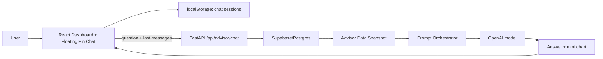

# Personal Finance AI Assistant

Ứng dụng quản lý tài chính cá nhân có dashboard, nhập sao kê ngân hàng, phân loại giao dịch, ngân sách, phát hiện bất thường và chatbot tài chính cá nhân "Fin".

Fin hiện chạy theo kiến trúc **OpenAI-first fintech advisor**: backend tự dựng bối cảnh tài chính từ database, sau đó gửi prompt có kiểm soát sang OpenAI. Chế độ `local` vẫn tồn tại như fallback offline cho phân loại giao dịch, nhưng trải nghiệm chatbot thông minh cần `AI_PROVIDER=openai`.

## Mục Tiêu Nghiệp Vụ

- Giúp user hiểu dòng tiền cá nhân theo chu kỳ hiện tại.
- Trả lời câu hỏi tài chính bằng dữ liệu thật của phiên đăng nhập, không dựa vào dữ liệu người dùng nhập tay từ frontend.
- Cảnh báo sớm khi dự báo chi tiêu vượt ngân sách.
- Hỏi xác nhận giao dịch bất thường trước khi đưa lời khuyên chắc chắn.
- Không tư vấn đầu tư rủi ro cao như crypto, margin, forex hoặc chứng khoán lướt sóng.
- Không hiển thị tên thật, số tài khoản đầy đủ, địa chỉ hoặc định danh nhạy cảm trong câu trả lời.

## Kiến Trúc Tổng Quan



## Thành Phần Chính

### Frontend

- Vite + React.
- Dashboard chính nằm trong `frontend/src`.
- Floating chatbot được mount toàn app trong `frontend/src/components/layout/Layout.jsx`.
- Chat UI nằm ở `frontend/src/components/ChatbotInterface.tsx`.
- Lịch sử chat lưu theo phiên trong `localStorage`, tự đặt tên phiên theo câu hỏi đầu tiên.
- UI hỗ trợ markdown, loading skeleton, mini-chart, phóng to/thu nhỏ, lịch sử phiên, clear history và security policy.

### Backend

- FastAPI service trong `src/spectra/web/server.py`.
- Endpoint chatbot: `POST /api/advisor/chat`.
- Backend đọc user từ session cookie, sau đó query database để dựng Data Snapshot.
- Frontend không gửi trực tiếp budget/spent để tránh user sửa payload làm sai phân tích.

### AI Orchestrator

- Logic AI nằm trong `src/spectra/ai.py`.
- Provider cloud chính: OpenAI.
- Model mặc định: `gpt-5.5`.
- Đường gọi chính: OpenAI Responses API.
- Chat Completions chỉ còn là fallback tương thích SDK nếu Responses API lỗi.
- System prompt gán vai "Fin", xưng "tớ - cậu", trả lời tự nhiên, có guardrail tài chính và bảo mật.

## Luồng Chatbot Fin

1. User mở widget Fin ở góc phải dưới.
2. User nhập câu hỏi, ví dụ: "Tôi có thể mua đôi giày 2 triệu hôm nay không?"
3. Frontend gửi:
   - `question`
   - tối đa 6 message gần nhất trong phiên hiện tại
4. Backend dựng Data Snapshot:
   - `budget`
   - `spent`
   - `days_remaining`
   - `prediction`
   - `remaining_budget`
   - `alerts`
   - `top_categories`
   - `financial_health`
   - `budget_utilization`
   - `user_mood_context`
   - `current_cycle`
5. Prompt Orchestrator ghép:
   - system instruction
   - Data Snapshot
   - conversation memory
   - intent của câu hỏi hiện tại
6. OpenAI trả lời.
7. Backend trả về:
   - `answer`
   - `chart` nếu câu hỏi cần phân tích chi tiêu
   - snapshot tóm tắt không nhạy cảm
8. Frontend render markdown và mini-chart trong chat bubble.

## Data Snapshot

Data Snapshot được build ở backend từ bảng `app_tx_history` theo `user_id` trong phiên đăng nhập. Snapshot không chứa số tài khoản đầy đủ hoặc địa chỉ.

Các trường quan trọng:

- `budget`: tổng ngân sách đã cấu hình cho chu kỳ.
- `spent`: tổng chi tiêu từ đầu chu kỳ.
- `days_remaining`: số ngày còn lại.
- `prediction`: dự báo chi tiêu cuối chu kỳ dựa trên burn rate hiện tại.
- `remaining_budget`: ngân sách còn lại.
- `alerts`: giao dịch bất thường so với lịch sử.
- `top_categories`: các nhóm chi tiêu lớn nhất.
- `financial_health`: `Safe`, `Watch`, `Critical` hoặc `Unknown`.
- `user_mood_context`: chỉ dẫn tone cho Fin.

## Logic Tài Chính

Fin phải trả lời đúng trọng tâm câu hỏi mới nhất.

- Nếu user chỉ chào/test: phản hồi xã giao, không tự phân tích ngân sách.
- Nếu user hỏi mua gì đó: so sánh giá trị khoản mua với `remaining_budget`, `prediction`, top spending và trạng thái sức khỏe tài chính.
- Nếu `prediction > budget`: cảnh báo sớm, gợi ý cắt giảm theo top 3 danh mục chi lớn nhất.
- Nếu có `alerts`: hỏi user xác nhận giao dịch bất thường trước khi đưa lời khuyên chắc chắn.
- Nếu `financial_health = Safe`: giọng thoải mái, khích lệ.
- Nếu `financial_health = Watch`: nhắc nhẹ, không làm quá vấn đề.
- Nếu `financial_health = Critical`: chân thành, quan tâm, không phán xét.
- Nếu user hỏi đầu tư rủi ro cao: từ chối lịch sự và kéo về quản trị rủi ro cá nhân.

## Prompt Và Guardrail

System prompt của Fin yêu cầu:

- Không nói "tôi là AI".
- Không dùng câu mở đầu máy móc như "Dựa trên dữ liệu tài chính của bạn".
- Không lộ thông tin định danh.
- Không bịa dữ liệu khi thiếu số liệu.
- Luôn phản hồi đồng cảm trước khi phân tích nếu user đang tâm sự.
- Luôn kết thúc bằng một câu hỏi gợi mở liên quan đến thói quen hoặc bối cảnh chi tiêu.
- Dùng conversation memory để không hỏi lại chuyện vừa nói.

## Bảo Mật

- `.env` đã nằm trong `.gitignore`; không commit API key.
- Không đưa API key vào README, issue, screenshot hoặc chat log.
- Vì key đã từng được dán vào cuộc trò chuyện, nên nên rotate key trên OpenAI dashboard sau khi test xong.
- Supabase RLS cần bật policy:

```sql
CREATE POLICY "Users can only access their own transactions"
ON app_tx_history
FOR SELECT
USING (auth.uid()::text = user_id);
```

Migration liên quan nằm tại `supabase/migrations/0004_app_tx_history_user_select_policy.sql`.

## Cấu Hình Môi Trường

File `.env` gốc cần có:

```env
DATABASE_URL=postgresql://...
BASE_CURRENCY=VND
AI_PROVIDER=openai
OPENAI_API_KEY=sk-...
OPENAI_MODEL=gpt-5.5
SPECTRA_BASE_URL=http://localhost:8081
```

Không còn dùng biến cloud AI cũ. Nếu muốn chạy offline hạn chế:

```env
AI_PROVIDER=local
```

Khi dùng Docker, `docker-compose.yml` truyền các biến:

- `AI_PROVIDER`
- `OPENAI_API_KEY`
- `OPENAI_MODEL`
- `DATABASE_URL`

## Cách Chạy Dự Án

### 1. Cài dependencies

```powershell
py -m pip install -e .
cd frontend
npm install
cd ..
```

### 2. Chạy Spectra backend

```powershell
py -m spectra --serve --port 8081
```

### 3. Chạy frontend

```powershell
cd frontend
npm run dev -- --host 127.0.0.1
```

Frontend thường chạy ở:

```text
http://localhost:3000
```

### 4. Chạy Bank Simulator

```powershell
cd bank_simulator
py main.py
```

Bank Simulator chạy ở:

```text
http://localhost:8000
```

### 5. Đăng nhập demo

1. Mở `http://localhost:3000`.
2. Chọn "Sign in with Bank".
3. Bank Simulator redirect về Spectra.
4. Dashboard hiển thị dữ liệu của user đã đăng nhập.
5. Fin xuất hiện ở góc phải dưới và có thể chat ở mọi màn hình.

## Test Case Khuyến Nghị

Sau khi login, mở Fin và hỏi:

```text
Tôi có thể mua đôi giày 2 triệu hôm nay không?
```

Kết quả đúng kỳ vọng:

- Fin không trả lời "có" hoặc "không" ngay lập tức.
- Fin kiểm tra ngân sách còn lại, dự báo cuối kỳ và nhóm chi tiêu lớn.
- Nếu còn dư an toàn: trả lời thoải mái nhưng vẫn nhắc giới hạn hợp lý.
- Nếu đã sát/vượt ngân sách: khuyên hoãn hoặc giảm khoản khác trước.
- Nếu có anomaly: hỏi xác nhận giao dịch bất thường trước.

Test câu xã giao:

```text
hello
```

Kết quả đúng kỳ vọng:

- Fin chỉ chào lại tự nhiên.
- Không tự phân tích ngân sách.
- Không hiển thị mini-chart.

## Các File Quan Trọng

- `src/spectra/config.py`: cấu hình provider, model, secret và database.
- `src/spectra/ai.py`: prompt, OpenAI call, fallback local, phân loại giao dịch.
- `src/spectra/web/server.py`: API, build Data Snapshot, auth/session, dashboard data.
- `frontend/src/components/ChatbotInterface.tsx`: floating chatbot UI, session history, message flow.
- `frontend/src/api/services.js`: API client.
- `frontend/src/index.css`: layout và style chatbot/dashboard.
- `supabase/migrations/0004_app_tx_history_user_select_policy.sql`: RLS policy.
- `bank_simulator/main.py`: service giả lập ngân hàng và SSO demo.

## OpenAI Runtime Notes

- Model mặc định dùng `gpt-5.5`, phù hợp cho reasoning và hội thoại tài chính có ngữ cảnh.
- Responses API được ưu tiên vì là API hiện đại cho tác vụ assistant có instruction rõ ràng.
- Backend không gửi dữ liệu định danh nhạy cảm trong prompt.
- Prompt chỉ nhận snapshot tài chính tổng hợp và lịch sử chat ngắn.
- Nếu OpenAI lỗi SDK endpoint, code fallback sang Chat Completions để tránh downtime.

Tham khảo chính thức:

- OpenAI models: https://platform.openai.com/docs/models
- OpenAI Responses API: https://platform.openai.com/docs/api-reference/responses

## Troubleshooting

### Fin trả lời như rule cứng hoặc thiếu thông minh

Kiểm tra `.env`:

```env
AI_PROVIDER=openai
OPENAI_API_KEY=sk-...
OPENAI_MODEL=gpt-5.5
```

Sau đó restart backend.

### Login bank lỗi callback

Đảm bảo:

```env
SPECTRA_BASE_URL=http://localhost:8081
```

và backend Spectra đang chạy ở port `8081`.

### Không thấy chatbot

Kiểm tra `FloatingAdvisorWidget` đã được mount trong `frontend/src/components/layout/Layout.jsx`, sau đó reload frontend.

### Module psycopg/psycopg2 lỗi

Dự án dùng `psycopg` v3. Cài lại:

```powershell
py -m pip install -e .
```

### Build frontend

```powershell
cd frontend
npm run build
```

## Trạng Thái Hiện Tại

- Cloud AI: OpenAI.
- Legacy cloud config/key: đã gỡ khỏi source config, UI, Docker và lockfile.
- Chatbot: floating toàn app, có lịch sử phiên, markdown, mini-chart, loading skeleton.
- Security posture: API key chỉ nằm trong `.env` local, không đưa vào tài liệu.
