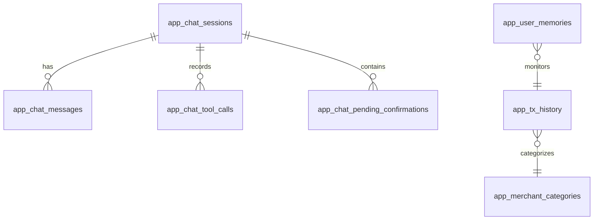
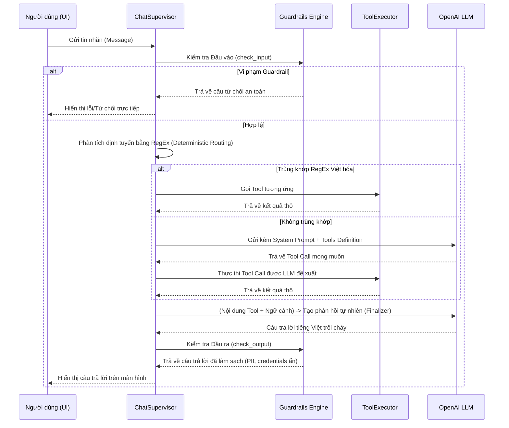
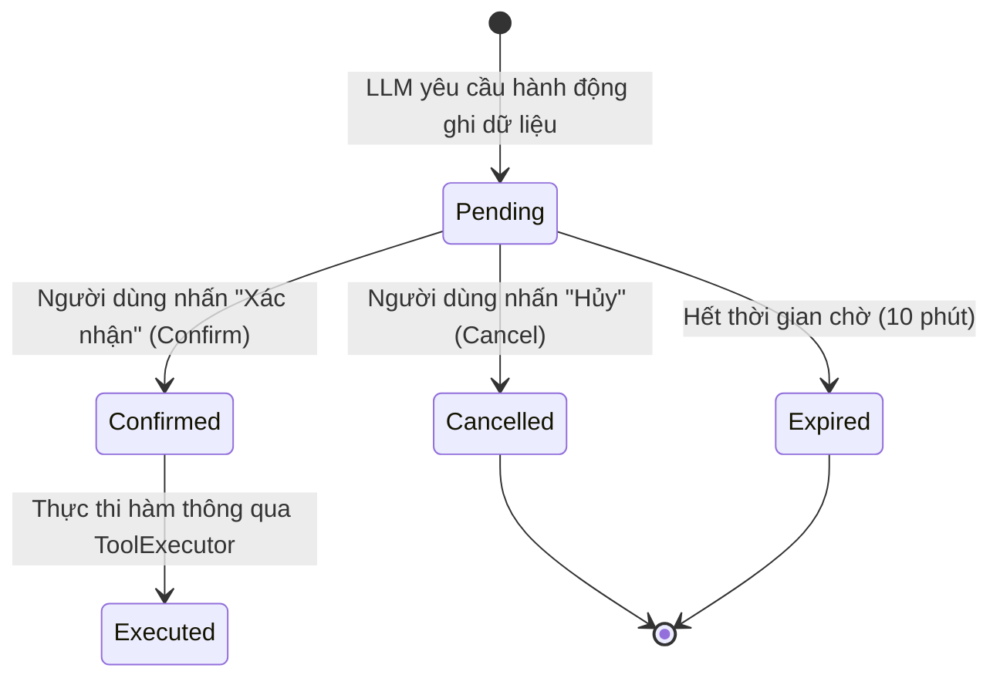

# Tài liệu Thiết kế Kỹ thuật (Technical Design Document - TDD)
## Hệ thống Quản lý Tài chính Cá nhân Spectra v3 (Tích hợp AI Assistant)

Spectra là nền tảng quản lý tài chính cá nhân được thiết kế hiện đại, cung cấp dashboard trực quan hóa dòng tiền và tích hợp trợ lý ảo (AI Chatbot) tiếng Việt thông minh. Trợ lý này hỗ trợ người dùng theo dõi chi tiêu, lập ngân sách, mô phỏng tài chính và tự động phân loại giao dịch ngân hàng một cách an toàn và bảo mật.

---

## 1. Kiến trúc Tổng quan (System Architecture)

Hệ thống Spectra được xây dựng theo mô hình client-server phân rã, kết hợp các cơ chế bảo mật nghiêm ngặt để bảo vệ dữ liệu tài chính nhạy cảm của người dùng.

```mermaid
graph TD
    subgraph Client Layer (Frontend)
        A[React App / Vite] -->|Yêu cầu HTTP / Cookie Auth| B(FastAPI Server)
    end

    subgraph Core Backend Layer
        B -->|Đọc/Ghi dữ liệu| C[(PostgreSQL / Supabase)]
        B -->|Lập luận & Hoàn thiện câu trả lời| D[OpenAI API / LLM]
        B -->|Giao tiếp qua REST| E[Bank Simulator]
    end

    subgraph Guardrails & Executor
        B -->|Chạy Input/Output Guards| F[Guardrail Engine]
        B -->|Thực thi API nội bộ| G[Tool Executor]
        G -->|Kiểm tra quyền và confirm| H[Confirmation Store]
    end
```

### Các thành phần chính của hệ thống:
1. **Frontend (React + Vite + Vanilla CSS)**: Dashboard người dùng hiển thị biểu đồ chi tiêu, ngân sách, xu hướng, quản lý giao dịch và khung chat tương tác thời gian thực với AI.
2. **Backend (FastAPI)**: Chịu trách nhiệm về logic nghiệp vụ, xác thực, quản lý phiên chat, tự động phân loại giao dịch, tính toán điểm sức khỏe tài chính và điều phối LLM.
3. **Database (PostgreSQL / Supabase)**: Lưu trữ lịch sử giao dịch ngân hàng, các tùy chỉnh của người dùng, luật phân loại, phiên hội thoại, lịch sử xác nhận và bộ nhớ dài hạn của chatbot.
4. **Bank Simulator**: Dịch vụ ngân hàng mô phỏng cục bộ để cấp quyền SSO (Single Sign-On), cung cấp dữ liệu giao dịch demo và dự báo số dư cho Spectra qua các API bảo mật.
5. **AI Orchestration & Guardrails**: Bộ động cơ an toàn chặn mã độc/prompt injection ở đầu vào, kiểm soát tham số gọi hàm (Tool call) và kiểm duyệt dữ liệu nhạy cảm đầu ra (PII, credentials, thông tin tài chính nhạy cảm).

---

## 2. Thiết kế Cơ sở dữ liệu (Database Schema)

Cơ sở dữ liệu của Spectra sử dụng PostgreSQL (tương thích Supabase) với sơ đồ các bảng được thiết kế để hỗ trợ hiệu năng cao và phân quyền người dùng (multi-tenancy) rõ ràng qua `user_id`.



### Chi tiết các bảng dữ liệu:

#### Bảng: `app_tx_history` (Lịch sử giao dịch của người dùng)
Lưu trữ toàn bộ giao dịch tài chính đã được đồng bộ từ ngân hàng hoặc tải lên từ file CSV/PDF/OFX.
| Tên cột | Kiểu dữ liệu | Ràng buộc | Mô tả |
| :--- | :--- | :--- | :--- |
| `tx_id` | `text` | PRIMARY KEY | ID định danh giao dịch duy nhất |
| `user_id` | `text` | NOT NULL DEFAULT '' | ID của người dùng sở hữu giao dịch |
| `date` | `date` | NOT NULL | Ngày phát sinh giao dịch |
| `clean_name` | `text` | NOT NULL | Tên merchant/đối tác đã được chuẩn hóa |
| `amount` | `numeric` | NOT NULL | Số tiền giao dịch (âm là chi tiêu, dương là thu nhập) |
| `category` | `text` | NOT NULL DEFAULT 'Chưa phân loại'| Nhóm danh mục chi tiêu/thu nhập |
| `original_description`| `text` | NOT NULL DEFAULT '' | Nội dung chuyển khoản gốc từ ngân hàng |

*Chỉ mục (Indexes):*
* `idx_app_tx_history_date` ON `app_tx_history` (`date DESC`) - Tối ưu hóa truy vấn các giao dịch gần nhất.
* `idx_app_tx_history_category` ON `app_tx_history` (`category`) - Tối ưu hóa gom nhóm theo danh mục.
* `idx_app_tx_history_user_id` ON `app_tx_history` (`user_id`) - Cô lập dữ liệu người dùng.

#### Bảng: `app_savings_goals` (Mục tiêu tiết kiệm)
Quản lý các kế hoạch tiết kiệm tài chính do người dùng tạo ra hoặc chatbot đề xuất.
| Tên cột | Kiểu dữ liệu | Ràng buộc | Mô tả |
| :--- | :--- | :--- | :--- |
| `id` | `text` | PRIMARY KEY | ID mục tiêu tiết kiệm |
| `user_id` | `text` | NOT NULL | ID người dùng |
| `name` | `text` | NOT NULL | Tên mục tiêu tiết kiệm (ví dụ: "Mua xe", "Quỹ khẩn cấp") |
| `target_amount` | `numeric(18,2)`| NOT NULL, > 0 | Số tiền mục tiêu cần tiết kiệm |
| `current_amount` | `numeric(18,2)`| NOT NULL DEFAULT 0, >= 0 | Số tiền hiện đã tích lũy được |
| `currency` | `text` | NOT NULL DEFAULT 'VND' | Đơn vị tiền tệ |
| `start_date` | `date` | NOT NULL | Ngày bắt đầu thực hiện |
| `target_date` | `date` | NOT NULL | Ngày mong muốn hoàn thành (phải sau start_date) |
| `monthly_required_amount`| `numeric(18,2)`| | Số tiền cần tích lũy định kỳ hàng tháng |
| `status` | `text` | NOT NULL DEFAULT 'active' | Trạng thái mục tiêu (`active`, `archived`, `completed`) |
| `priority` | `text` | NOT NULL DEFAULT 'medium' | Mức độ ưu tiên (`low`, `medium`, `high`) |
| `metadata_json` | `jsonb` | NOT NULL DEFAULT '{}' | Metadata bổ sung chứa thông số giả lập |

#### Bảng: `app_chat_sessions` (Phiên hội thoại)
Quản lý các phiên trò chuyện của người dùng với chatbot nhằm duy trì ngữ cảnh.
| Tên cột | Kiểu dữ liệu | Ràng buộc | Mô tả |
| :--- | :--- | :--- | :--- |
| `id` | `text` | PRIMARY KEY | ID phiên chat |
| `user_id` | `text` | NOT NULL | ID người dùng sở hữu phiên chat |
| `title` | `text` | NOT NULL DEFAULT '' | Tiêu đề tóm tắt của cuộc trò chuyện |
| `status` | `text` | NOT NULL DEFAULT 'active' | Trạng thái phiên chat (`active`, `archived`, `deleted`) |
| `created_at` | `timestamptz` | NOT NULL DEFAULT now()| Thời gian tạo phiên |
| `last_message_at` | `timestamptz` | | Thời điểm nhận tin nhắn cuối cùng |
| `metadata_json` | `jsonb` | NOT NULL DEFAULT '{}' | Metadata phiên chat |

#### Bảng: `app_chat_messages` (Lịch sử tin nhắn)
Lưu lại toàn bộ nội dung tin nhắn gửi và nhận trong từng phiên hội thoại.
| Tên cột | Kiểu dữ liệu | Ràng buộc | Mô tả |
| :--- | :--- | :--- | :--- |
| `id` | `text` | PRIMARY KEY | ID tin nhắn |
| `session_id` | `text` | REFERENCES app_chat_sessions| FK trỏ đến phiên hội thoại |
| `user_id` | `text` | NOT NULL | ID người dùng |
| `role` | `text` | CHECK IN ('user', 'assistant', 'system', 'tool')| Vai trò của đối tượng gửi tin nhắn |
| `content` | `text` | NOT NULL | Nội dung tin nhắn (đã qua lọc dữ liệu nhạy cảm) |
| `intent` | `text` | | Ý định (intent) được phân tích từ tin nhắn người dùng |
| `created_at` | `timestamptz` | NOT NULL DEFAULT now()| Thời gian gửi tin nhắn |

#### Bảng: `app_chat_pending_confirmations` (Hành động chờ xác nhận)
Lưu trạng thái tạm thời của các thay đổi dữ liệu nhạy cảm do LLM sinh ra cần được người dùng bấm duyệt trước khi thực thi.
| Tên cột | Kiểu dữ liệu | Ràng buộc | Mô tả |
| :--- | :--- | :--- | :--- |
| `id` | `text` | PRIMARY KEY | ID giao dịch xác nhận (ví dụ: `confirm_xxxx`) |
| `user_id` | `text` | NOT NULL | ID người dùng thực hiện duyệt |
| `action_type` | `text` | NOT NULL | Loại hành động (ví dụ: `update_transaction_category`) |
| `tool_name` | `text` | NOT NULL | Tên tool tương ứng trong backend cần chạy |
| `tool_arguments_json` | `jsonb`| NOT NULL DEFAULT '{}' | Các tham số truyền vào tool call |
| `human_summary` | `text` | NOT NULL DEFAULT '' | Tóm tắt hành động bằng ngôn ngữ tự nhiên |
| `status` | `text` | CHECK IN (`pending`, `confirmed`, `cancelled`, `expired`) | Trạng thái phê duyệt |
| `expires_at` | `timestamptz` | NOT NULL | Thời hạn hết hạn của mã duyệt (mặc định 10 phút) |

#### Bảng: `app_user_memories` (Bộ nhớ học máy dài hạn)
Lưu trữ thông tin phi cấu trúc mà chatbot học được về thói quen tài chính của người dùng nhằm cá nhân hóa câu trả lời.
| Tên cột | Kiểu dữ liệu | Ràng buộc | Mô tả |
| :--- | :--- | :--- | :--- |
| `id` | `text` | PRIMARY KEY | ID bộ nhớ |
| `user_id` | `text` | NOT NULL | ID người dùng |
| `memory_type` | `text` | NOT NULL | Phân loại bộ nhớ (ví dụ: `preference`, `saving_goal`) |
| `key` | `text` | NOT NULL | Khóa định danh thông tin lưu trữ |
| `value_json` | `jsonb` | NOT NULL DEFAULT '{}' | Nội dung thông tin học được dưới dạng JSON |
| `confidence` | `numeric(4,3)`| NOT NULL DEFAULT 1.0 | Độ tin cậy của bộ nhớ |
| `status` | `text` | NOT NULL DEFAULT 'active' | Trạng thái hoạt động của bộ nhớ |

---

## 3. Hệ thống API Endpoints (API Inventory)

Các API của backend FastAPI được chia làm các nhóm nghiệp vụ chính:

### Nhóm API Xác thực & SSO:
* `GET /api/auth/me`: Kiểm tra thông tin phiên đăng nhập hiện tại.
* `POST /api/auth/login`: Endpoint đăng nhập tài khoản demo.
* `POST /api/auth/logout`: Đăng xuất và xóa session cookie.
* `GET /sso/bank`: Bắt đầu luồng đăng nhập Single Sign-On liên kết với Bank Simulator.

### Nhóm API Giao dịch & Phân loại:
* `GET /api/transactions`: Tìm kiếm và lọc danh sách giao dịch có phân trang.
* `PATCH /api/transactions/{tx_id}`: Cập nhật thông tin danh mục hoặc merchant cho một giao dịch.
* `POST /api/transactions/bulk-category`: Cập nhật danh mục hàng loạt giao dịch.
* `GET /api/categories/options`: Lấy danh sách các nhóm danh mục chi tiêu hợp lệ hỗ trợ tiếng Việt.

### Nhóm API Quản lý Ngân sách & Mục tiêu:
* `GET /api/budget`: Lấy trạng thái ngân sách của chu kỳ hiện tại (các nhóm đã chi tiêu quá hạn mức hoặc có nguy cơ vượt).
* `PATCH /api/budget/{category}`: Thiết lập hoặc sửa hạn mức ngân sách hàng tháng cho từng danh mục.
* `GET /api/savings-goals`: Danh sách mục tiêu tiết kiệm đang thực hiện của người dùng.
* `POST /api/savings-goals/plan`: Tính toán kế hoạch khả thi cho mục tiêu tiết kiệm.
* `POST /api/savings-goals`: Tạo mới mục tiêu tiết kiệm.

### Nhóm API Trợ lý ảo (Chatbot):
* `POST /api/chat`: Điểm kết nối chính để gửi câu hỏi của người dùng và nhận câu trả lời từ chatbot.
* `GET /api/chat/sessions`: Lấy danh sách các phiên trò chuyện lịch sử của người dùng.
* `GET /api/chat/sessions/{session_id}/messages`: Truy vấn lịch sử tin nhắn trong phiên chat.
* `GET /api/chat/memories`: Lấy bộ nhớ cá nhân hóa mà chatbot đang ghi nhớ về người dùng.
* `POST /api/chat/feedback`: Gửi đánh giá Thumbs Up/Down của người dùng đối với chất lượng câu trả lời.

---

## 4. Cơ chế AI Chatbot & Quy trình Xử lý (Chatbot Engine)

AI Assistant của Spectra sử dụng mô hình tác nhân giám sát (Supervisor Agent) kết hợp với các công cụ lập luận (Tools) có tính xác định cao.

### 4.1 Quy trình Điều phối và Phân tích Intent
Khi người dùng gửi tin nhắn, `ChatSupervisor` sẽ xử lý thông tin theo các bước sau:



### 4.2 Cơ chế Định tuyến Xác định (Deterministic Routing)
Để tiết kiệm chi phí gọi LLM và tăng tốc độ phản hồi đối với các câu hỏi tiếng Việt phổ biến, `ChatSupervisor` duy trì một danh sách các mẫu từ khóa để định tuyến trực tiếp đến các tool đọc dữ liệu tương ứng:
* **Chi tiêu định kỳ**: `khoan dinh ky`, `subscription`, `lap lai`, `hang thang` $\rightarrow$ `get_recurring_transactions`
* **So sánh chi tiêu**: `so voi thang truoc`, `tang giam o dau`, `khac gi thang truoc` $\rightarrow$ `compare_period_spending`
* **Lý do vượt chi**: `tai sao vuot ngan sach`, `vi sao tieu nhieu` $\rightarrow$ `explain_budget_overrun`
* **Dòng tiền**: `lich dong tien`, `tu gio toi cuoi thang`, `khi nao thieu tien` $\rightarrow$ `get_cashflow_calendar`
* **Giả lập mua sắm**: `mua ... co on khong`, `neu chi ... thi sao` $\rightarrow$ `simulate_purchase_impact`
* **Khoản nợ**: `tra gop`, `tra no`, `khoan no`, `con no` $\rightarrow$ `get_debt_summary`
* **Quỹ dự phòng**: `quy khan cap`, `song duoc may thang`, `mat thu nhap` $\rightarrow$ `get_emergency_fund_status`

---

## 5. Các Cơ chế An toàn & Bảo mật (Safety Framework)

Hệ thống tích hợp khung bảo mật nhiều lớp tại `spectra/chat/guardrails` để kiểm soát mọi hành vi của tác nhân AI trước khi tác động lên dữ liệu người dùng.

### 5.1 Các Lớp Kiểm duyệt của Guardrail Engine

1. **Input Guardrails (Lọc đầu vào)**:
   * `PromptInjectionGuard`: Phát hiện và ngăn chặn các hành vi tấn công ghi đè chỉ thị hệ thống (System prompt override).
   * `OutOfScopeGuard`: Từ chối trả lời các câu hỏi không liên quan đến tài chính cá nhân (ví dụ: thời tiết, lập trình, viết thơ).
   * `InvestmentAdviceGuard`: Chặn các yêu cầu tư vấn đầu tư cụ thể (ví dụ: "Nên mua coin nào?", "Mua cổ phiếu mã nào?"). Hệ thống chỉ đưa ra lời khuyên lập ngân sách và tiết kiệm chung.
   * `SensitiveDataGuard`: Không cho phép người dùng cố tình gửi mã khóa bí mật, khóa API hoặc mật khẩu vào ô chat.

2. **Tool Guardrails (Lọc gọi hàm)**:
   * `UnregisteredToolGuard`: Chặn mọi nỗ lực của LLM nhằm gọi các tool không nằm trong danh sách đăng ký hoặc các lệnh hệ thống nguy hiểm (ví dụ: `reset_db`).
   * `ToolParameterGuard`: Kiểm tra và kẹp chặt (clamp) các tham số đầu vào của tool để tránh tấn công SQL Injection hoặc tràn dữ liệu (ví dụ: ép kiểu `limit` trong khoảng $[1, 20]$, `days` tối đa là $90$).
   * `WriteConfirmationGuard`: Bắt buộc tất cả các thao tác sửa đổi dữ liệu (Write operations) phải có ID xác nhận hợp lệ được tạo bởi store.

3. **Output Guardrails (Lọc đầu ra)**:
   * `CredentialLeakGuard`: Phát hiện và che giấu các khóa bí mật dạng `sk-...`, mật khẩu, hoặc token vô tình bị LLM phản hồi.
   * `PIILeakGuard`: Tự động ẩn số tài khoản ngân hàng đầy đủ, mã số định danh của người dùng.
   * `DisclaimerEnforcerGuard`: Tự động đính kèm khuyến cáo miễn trừ trách nhiệm tài chính khi chatbot đưa ra dự báo số dư hoặc giả lập tài chính.

---

### 5.2 Luồng Phê duyệt 2 Bước (Two-Step Confirmation Flow)

Để ngăn chatbot tự động thực hiện các hành động ghi hoặc xóa dữ liệu ngoài ý muốn khi chưa được người dùng cho phép, Spectra thiết kế một hệ thống máy trạng thái phê duyệt (Pending Confirmation Store).



#### Cách hoạt động chi tiết:
1. Khi LLM quyết định chạy một **Write Tool** (ví dụ: `update_transaction_category` hoặc `create_savings_goal`), thay vì thực thi ngay lập tức, `ToolExecutor` sẽ gọi `pending_actions.create(...)`.
2. Hệ thống lưu trữ tham số thực thi vào bảng `app_chat_pending_confirmations`, tạo ra một mã định danh duy nhất `confirmation_id` và sinh ra một thẻ xác nhận trực quan (Confirmation Card) hiển thị trên giao diện của người dùng.
3. Chatbot trả về thông điệp chứa nội dung tóm tắt hành động kèm theo thẻ xác nhận này.
4. Khi người dùng nhấn **Xác nhận**, frontend gửi yêu cầu `POST /api/confirm` kèm theo `confirmation_id`. Backend tải lại tham số gốc từ database, xác minh tính chính danh của người dùng và thực thi hành động.

---

### 5.3 Lớp Hoàn thiện Câu trả lời An toàn (Safe Finalizer Layer)
Sau khi thực thi các tool đọc thông tin, câu trả lời từ các tool call được kết hợp với câu hỏi gốc gửi đến một LLM trung gian gọi là **Chat Finalizer** để viết lại câu trả lời thành văn bản tự nhiên dễ hiểu.
Để tránh LLM trung gian này bị đánh lừa hoặc làm rò rỉ dữ liệu, đầu ra của Safe Finalizer được lọc qua biểu thức chính quy nghiêm ngặt:
* Không chứa các API key (`sk-...`).
* Không chứa tên hàm backend (ví dụ: `get_transactions`).
* Không chứa chuỗi số dài liên tiếp (ngăn lộ số tài khoản).
* Không chứa chuỗi định danh UUID.

Nếu phát hiện vi phạm, hệ thống sẽ tự động hủy bỏ phản hồi của Finalizer và chuyển sang dùng câu trả lời dự phòng (Fallback answer) đã được tạo sẵn một cách an toàn từ backend.

---

## 6. Kiểm thử và Đảm bảo Chất lượng (Testing & Verification)

Hệ thống Spectra duy trì độ tin cậy thông qua bộ kiểm thử tự động phong phú đặt tại thư mục `tests/chatbot/`.

### 6.1 Cấu trúc các Test Cases
* **Kiểm thử Đơn vị (Unit Tests)**:
  * `test_tool_registry.py`: Đảm bảo tất cả các tool được đăng ký đúng quyền hạn, schema đầu vào hợp lệ.
  * `test_write_tool_safety.py`: Xác minh các tool ghi dữ liệu bị chặn nếu không có bước phê duyệt.
  * `test_guardrails.py`: Kiểm tra khả năng phát hiện prompt injection, lời khuyên đầu tư sai lệch và rò rỉ khóa bí mật.
* **Kiểm thử Tích hợp (Integration Tests)**:
  * `test_phase8_5_memory_flows.py`: Kiểm tra sự tương tác giữa bộ nhớ hội thoại và gợi ý phân loại giao dịch.
  * `test_read_finalizer.py`: Đảm bảo quy trình viết lại câu trả lời thông qua Safe Finalizer hoạt động ổn định, không làm biến đổi dữ liệu tài chính gốc.

### 6.2 Chạy kiểm thử tự động
Để chạy toàn bộ bộ kiểm thử dành cho chatbot, sử dụng lệnh sau trong môi trường ảo:

```powershell
uv run pytest tests/chatbot -v
```

---

## 7. Kế hoạch phát triển các Phase tiếp theo (Roadmap)

Dựa trên thiết kế hiện tại, các phase tiếp theo của hệ thống Spectra được đề xuất triển khai các tính năng:
1. **Thiết lập Nhắc nhở và Hóa đơn**: Bổ sung bảng dữ liệu nhắc nhở thanh toán tự động và giao diện quản lý lịch đóng tiền.
2. **Sổ tay Quản lý Nợ chi tiết (Debt Ledger)**: Thêm bảng theo dõi các khoản vay/nợ, lãi suất (APR), kỳ hạn thanh toán và số dư nợ thực tế thay vì suy luận từ lịch sử giao dịch.
3. **Thẻ Tương tác Chi tiết (Interactive Cards)**: Thiết kế giao diện chat hiển thị biểu đồ so sánh chi tiêu trực quan ngay trong cuộc hội thoại thay vì định dạng text thuần túy.
